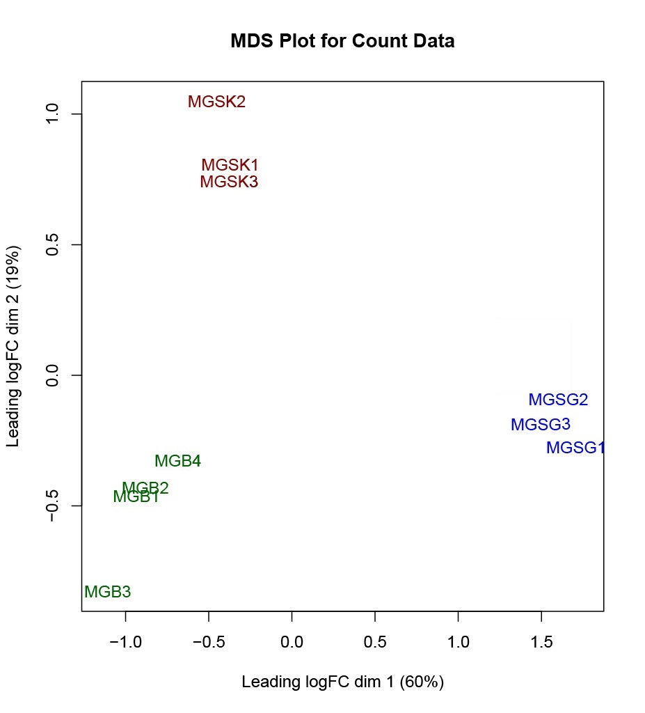
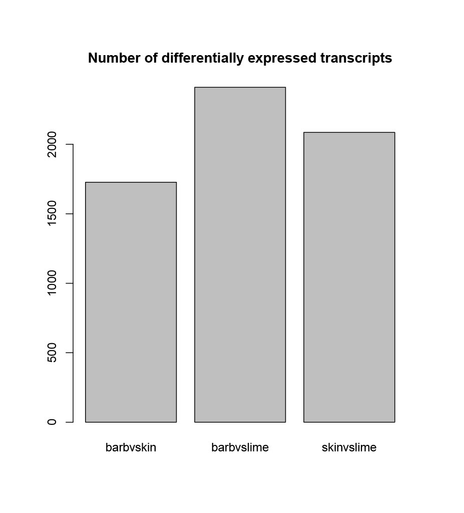
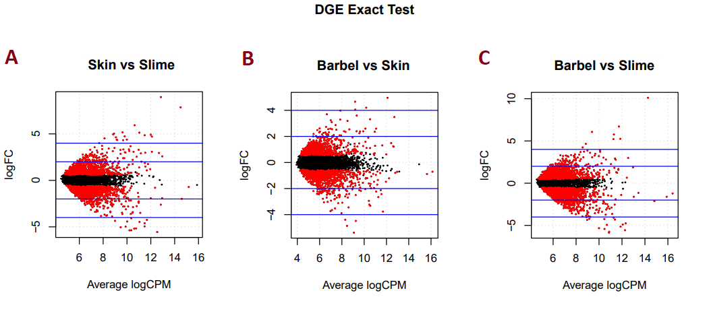

# Hagfish Transcriptomics

## Introduction
Hagfish (Class Myxini) are the outgroup to all vertebrates. Because of their position on the metazoan tree, hagfish genomes are useful for comparative studies of vertebrate evolution. The first known fossil hagfishes are about 500 million years old (Miyashita *et al*., 2019). However, the oldest fossil hagfishes lack slime glands–a structure found in modern hagfishes. Slime glands are a novel structure for predator defense through which slime gets excreted and clogs the gills of predators. Slime glands are a relatively recent adaptation, first appearing in the fossil record about 100 mya (Miyashita *et al*., 2019). 
Slime glands are hypothesized to have evolved from skin (Fudge and Schorno, 2016). Previous work has shown that a homologous gene in the skin is also present in jawed fishes and functions in tissue repair (personal communication, unpublished data from Dr. David Plachetzki, 2022) and larval development (Schaffield and Schultess, 2006). As such, we were interested in identifying genes that are differentially expressed in *Myxine glutinosa* (Atlantic hagfish) slime glands in comparison to skin and barbel tissue. 
 
## Methods

We obtained *M. glutinosa* paired-end RNA sequences in fastq format from Dr. David Plachetzki and the Plachetzki lab, as a part of unpublished data from 2019. These included four barbel samples, three skin samples, and three slime gland samples. All scripts (2_trinity.slurm, 3.A_rename_fa_headers.py, salmon.slurm, EdgeRScript) were also provided by Dr. David Plachetzki, and we edited them to work with the provided samples.
We first assembled a transcriptome with Trinity (2_trinity.slurm). Forward reads were concatenated to one file from forward reads from one skin, slime gland, and barbel sample each. We also concatenated backward reads from one of each sample. The headers within read files were renamed in preparation for mapping (3.A_rename_fa_headers.py). We then mapped all reads to the transcriptome using Salmon (salmon.slurm). These steps were performed on our laptops using the UNH Premise servers.
Next, we uploaded the output from salmon to RStudio to analyze gene expression (EdgeRScript). Our analysis in EdgeR included a multidimensional scaling plot (MDS), a count of differentially expressed transcripts, and pairwise comparisons of transcript expression among the three tissues. 
Finally, we identified the genes most differentially expressed between tissues from the pairwise comparisons and used BLAST search of nucleotide sequences to identify homologous sequences.
Throughout our analysis, we mainly had compatibility issues between the provided RScript and older versions of R. This was only able to be solved by using a different laptop that had the most updated version of R already installed on it.
 
## Findings
The profiles of transcript expression among our samples are similar within samples and are different between samples (Figure 1), which confirms their relevance for our project. The greater similarity of expression of barbel tissue and slime glands when either are compared to skin than when compared to each other might suggest that both these tissues diverged from skin cells (Figure 2). This is supported by Fudge and Schorno (2016), which hypothesized that slime glands evolved from skin tissue.
The results of the  DGE exact test showed several differentially expressed genes (Figure 3). After conducting BLAST searches of the nucleotide sequences, we identified six transcripts upregulated in slime glands that share homology with sequences in the BLAST database. Genes differentially expressed in slime glands in comparison to both skin and barbel tissue include: 
Annexin and Annexin 1 proteins from samples across phylum Chordata [~45% identity]
Thread biopolymer filament subunit alpha in *Eptatretus stoutii* (Pacific hagfish) [~47% identity]
Protein S100 across subphylum Vertebrata [~50% identity]
Endosome regulatory proteins used in biofilament assembly [~50%]
Rab-GAP TBC domain-containing protein (Esox lucius)
ALMS_motif domain-containing protein (Monodelphis domestica)
Additional genes upregulated in slime glands in comparison to only skin cells include:
C-type lectin-domain containing proteins, which bind calcium and carbohydrates [~45% identity]
Fibrillar collagen NC1 domain-containing protein and collagen alpha-1(II) chain throughout from samples across phylum Chordata [~65% identity]

Figure 1. Multidimensional scaling plot (MDS) which shows clear and separate spatial grouping for the expression profiles of each tissue type. This plot was created with EdgeR using the salmon.slurm output.

Figure 2. Bar plot representing the number of differentially expressed transcripts in pairwise comparisons between tissues. Comparison of barbel and slime gland tissue has the greatest number of differentially expressed transcripts, while both barbel and slime gland tissues each had fewer differences in gene expression when either were compared to skin tissues. This plot was created with EdgeR using the salmon.slurm output.

Figure 3. Differential gene expression (DGE) exact tests between pairs of samples represent how expression of individual transcripts differ between tissues. Each point represents a different transcript, with differentiation increasing as distance from zero increases. Transcripts in red are differentially expressed in one tissue while those in black have a negligible difference of expression between tissues. This plot was created with EdgeR using the salmon.slurm output. A) Transcripts upregulated in skin have positive logFC values while those upregulated in slime glands have negative logFC values. B) Transcripts upregulated in barbel tissue have positive logFC values while those upregulated in skin tissue have negative logFC values. A) Transcripts upregulated in barbel tissue have positive logFC values while those upregulated in slime glands have negative logFC values.

## Works cited
Miyashita, T., Coates, M.I., Farrar R., and Currie, P.J. 2019. Hagfish from the Cretaceous Tethys Sea and a reconciliation of the morphological–molecular conflict in early vertebrate phylogeny. PNAS. 116(6): 2146-2151. 

Schaffield, M. and Schultess, J. 2006. Genes coding for intermediate filament proteins closely related to the hagfish “thread keratins (TK)” α and γ also exist in lamprey, teleosts and amphibians. Experimental Cell Research. 312(9): 1447-1462. 

Fudge, D.S., and Schorno, S. 2016. The hagfish gland thread cell: a fiber-producing cell involved in predator defense. Cells. 5(2): 25. 

